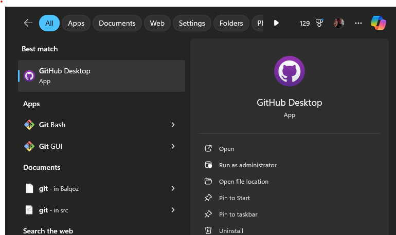
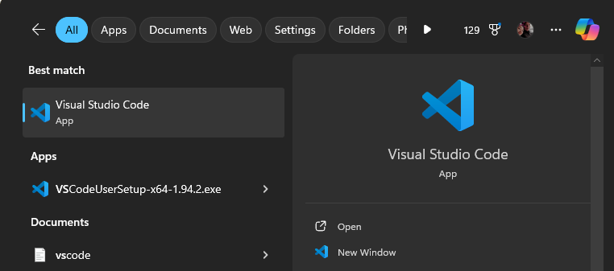
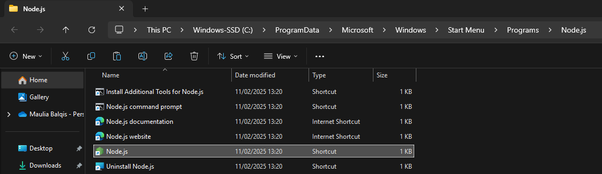
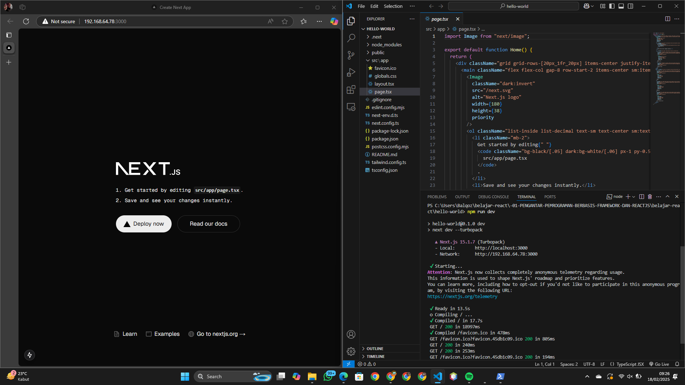

# Pertanyaan Praktikum 1
## 1. Jelaskan kegunaan masing-masing dari Git, VS Code dan NodeJS yang telah Anda install
pada sesi praktikum ini!
- **Git:** Digunakan untuk mengelola versi kode, melacak perubahan, dan memfasilitasi kolaborasi dalam pengembangan perangkat lunak.
- **VS Code:** Editor kode yang ringan dan fleksibel dengan fitur seperti debugging, ekstensi, serta integrasi Git.
- **Node.js:** Runtime yang memungkinkan eksekusi JavaScript di luar browser, sering digunakan untuk pengembangan backend.

2. Buktikan dengan screenshoot yang menunjukkan bahwa masing-masing tools tersebut
telah berhasil terinstall di perangkat Anda!

# Pertanyaan Praktikum 2
## **1. Pada Langkah ke-2, setelah membuat proyek baru menggunakan Next.js, terdapat beberapa istilah yang muncul. Jelaskan istilah tersebut, TypeScript, ESLint, Tailwind CSS, App Router, Import alias, App router, dan Turbopack!**  
- **TypeScript**: Superset dari JavaScript yang menambahkan fitur **static typing** untuk meningkatkan keandalan dan maintainability kode.  
- **ESLint**: Alat untuk **menjaga kualitas kode** dengan mendeteksi kesalahan sintaks dan memastikan kode sesuai dengan standar yang ditetapkan.  
- **Tailwind CSS**: Framework **CSS utility-first** yang memungkinkan pengembangan UI dengan lebih cepat menggunakan kelas-kelas bawaan.  
- **App Router**: Sistem routing berbasis folder dan file di Next.js yang menggantikan **pages router**, memberikan **struktur yang lebih fleksibel**.  
- **Import Alias**: Fitur yang memungkinkan **penggunaan alias** pada path impor untuk mempermudah navigasi dan menghindari penggunaan path relatif panjang.  
- **Turbopack**: Bundler baru dari Vercel yang menggantikan Webpack di Next.js, **lebih cepat dan efisien** dalam proses build dan HMR (Hot Module Replacement).  

## **2. Apa saja kegunaak folder dan file yang ada pada struktur proyek React yang tampil pada gambar pada tahap percobaan ke-3!**  
- **app/**: Folder utama untuk komponen dan halaman dalam sistem **App Router**.  
- **pages/**: Jika masih digunakan, berisi file untuk sistem **Pages Router** (sebelum Next.js 13).  
- **public/**: Menyimpan **aset statis** seperti gambar dan ikon.  
- **styles/**: Menyimpan file **CSS atau Tailwind** yang digunakan dalam proyek.  
- **.eslintrc.json**: Konfigurasi **ESLint** untuk menjaga standar kode.  
- **next.config.js**: File **konfigurasi Next.js** untuk mengatur fitur seperti alias, optimasi gambar, dan lainnya.  
- **package.json**: Berisi **informasi proyek** dan dependensi yang digunakan.  
- **tsconfig.json** (jika TypeScript digunakan): Konfigurasi **TypeScript** untuk proyek.  

## **3. Buktikan dengan screenshoot yang menunjukkan bahwa tahapan percobaan di atas telah berhasil Anda lakukan!**  
