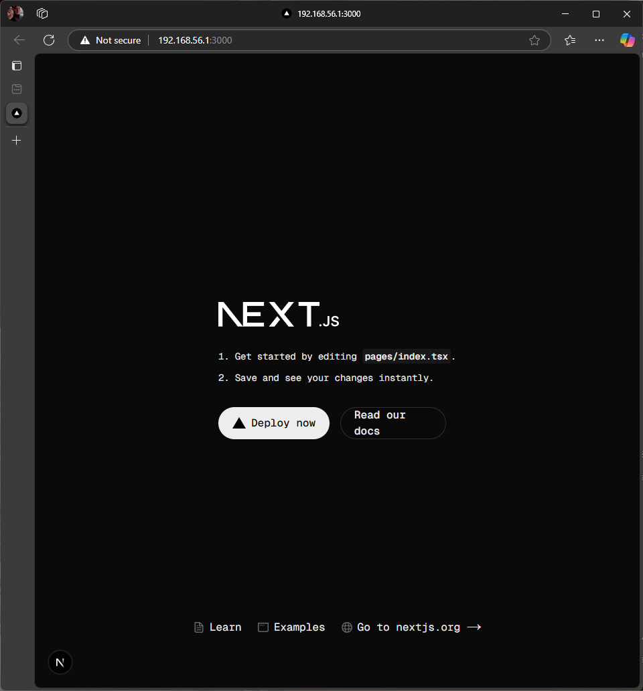
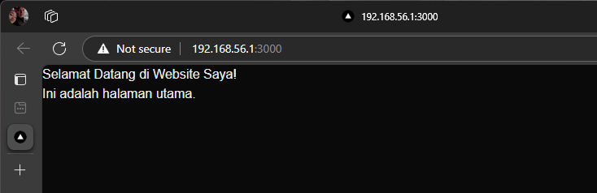
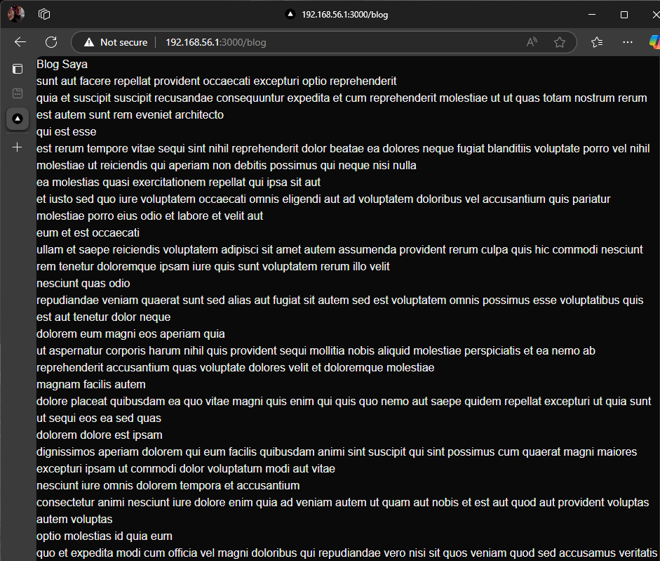
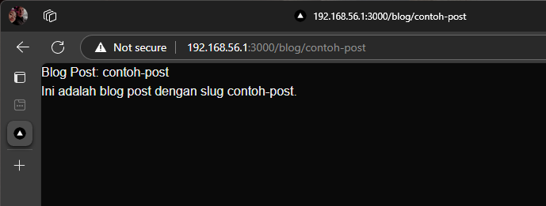
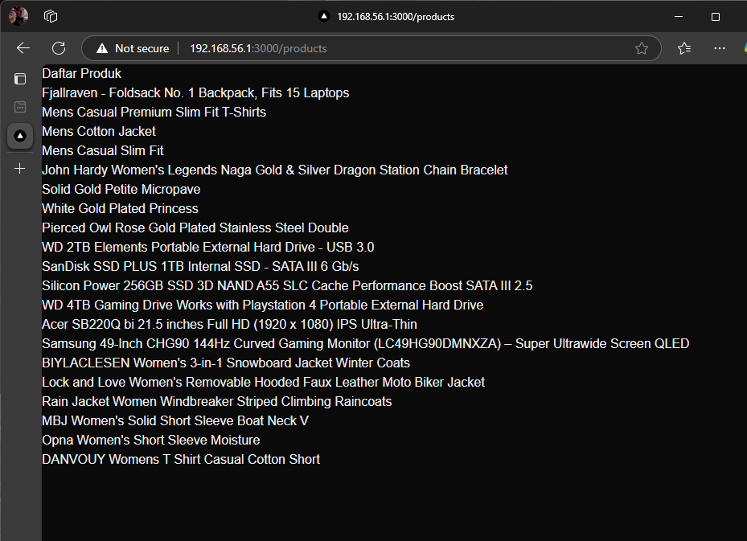
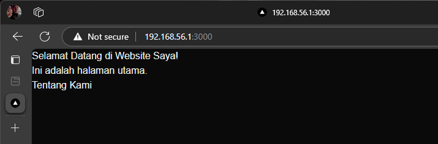
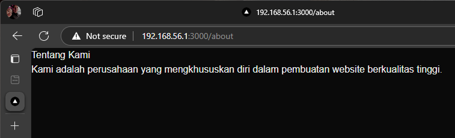

# Practicum
## 1. Persiapan Lingkungan

## 2. Membuat Halaman dengan Server-Side Rendering (SSR)

## 3. Menggunakan Static Site Generation (SSG)

## 4. Menggunakan Dynamic Routes

## 5. Menggunakan API Routes

## 6. Menggunakan Link Component

# Tugas
## 1. Buat halaman baru dengan menggunakan Static Site Generation (SSG) yang menampilkan daftar pengguna dari API https://jsonplaceholder.typicode.com/users.
## 2. Implementasikan Dynamic Routes untuk menampilkan detail pengguna berdasarkan ID.
## 3. Buat API route yang mengembalikan data cuaca dari API eksternal (misalnya, OpenWeatherMap) dan tampilkan data tersebut di halaman front-end.
