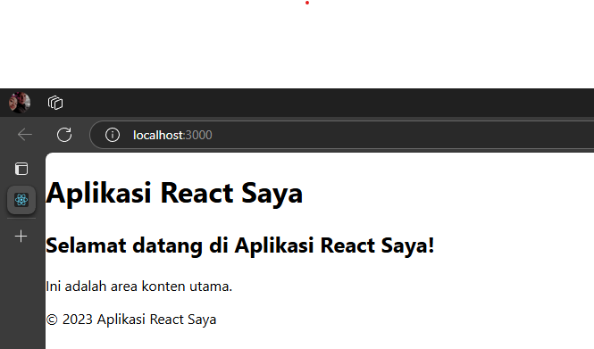
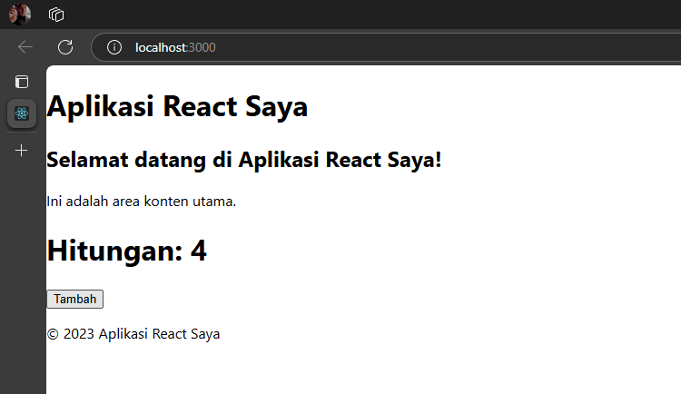
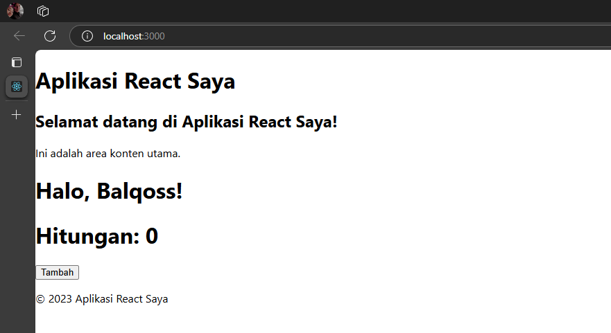
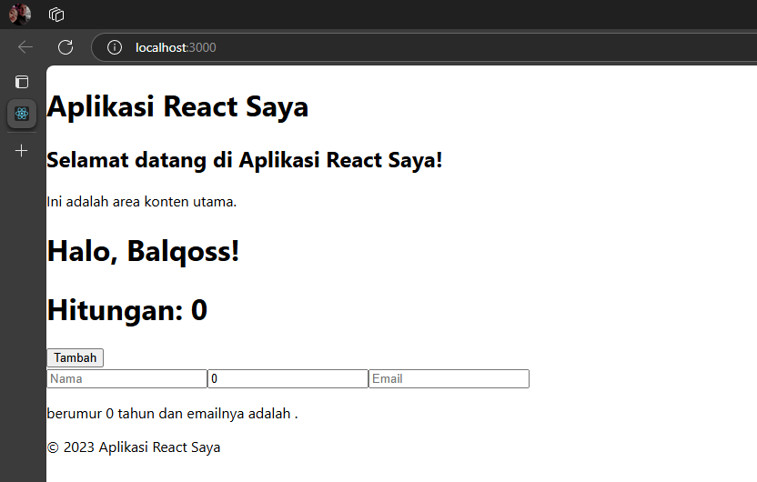
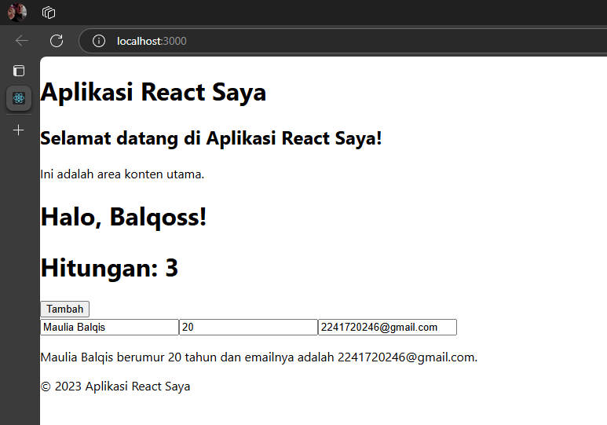
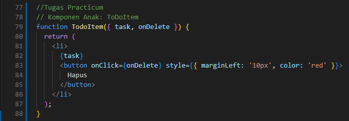
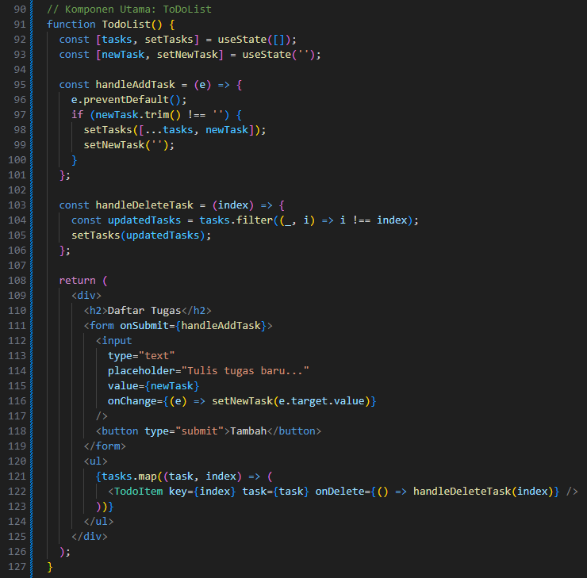
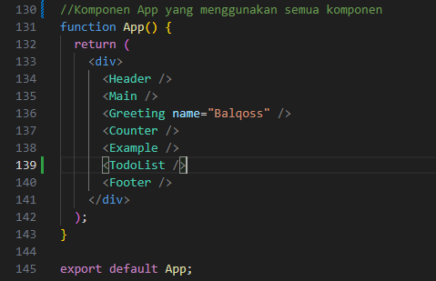
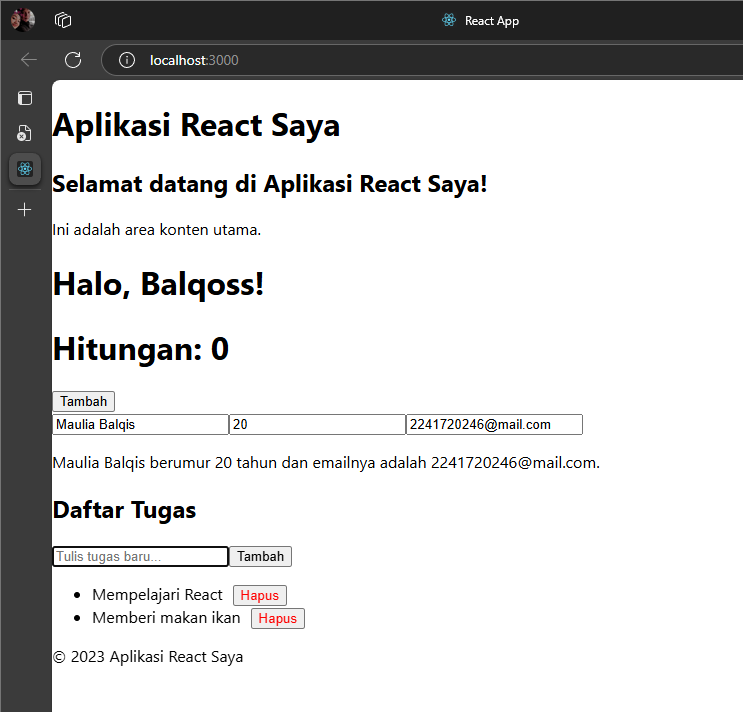
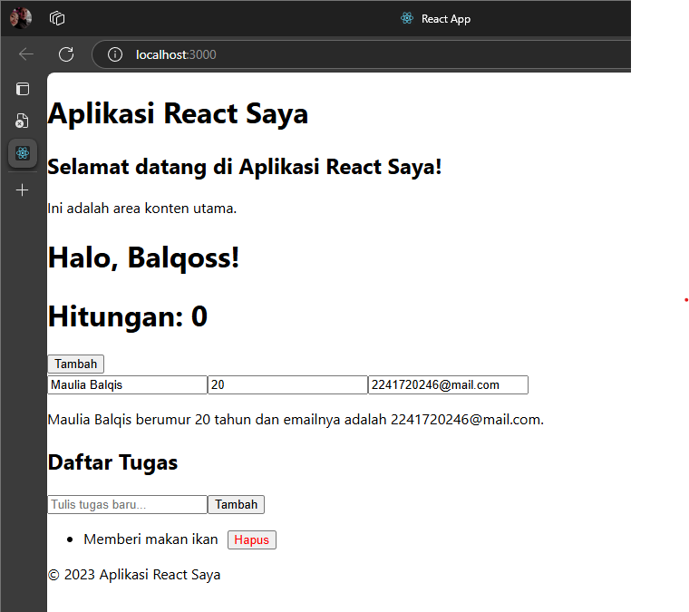

# Practicum
## 1. Persiapan Lingkungan
Node.js dan npm sudah berhasil terinstal dan bisa dijalankan.

## 2. Membuat Komponen React
Untuk step by step sudah saya ikuti sesuai perintah pada jobsheet, dengan membuat komponen Header, Main, Footer. Sehingga pada halaman web muncul seperti dibawah ini

## 3. Menggunakan JSX untuk Membuat Komponen Dinamis
Setelah pada halaman web muncul seperti langkah ke-2 dan ditambahkan komponen Counter, maka tampilan pada halaman web berubah seperti gambar dibawah ini

## 4. Menggunakan Props untuk Mengirim Data
Setelah ada perubahan pada langkah ke-3, saya juga sudah menambahkan komponen Greeting, maka tampilan pada halaman web berubah lagi seperti dibawah ini

## 5. Menggunakan State untuk Mengelola Data
Setelah ada perubahan pada langkah ke-4, saya juga sudah menambahkan komponen Example, maka tampilan pada halaman web berubah lagi seperti dibawah ini

Kemudian pada tabel tersebut, saya bisa menambahkan nama saya, umur, dan email saya seperti dibawah ini

# Tugas
1.  
2. 
3.   
Penjelasan:
- Pengguna dapat mengetik tugas baru di kotak input.
- Klik tombol "Tambah" untuk menambahkan tugas ke daftar.
- Setelah pengguna menambahkan tugas, tugas tersebut akan muncul dalam bentuk list.
- Setiap item list menampilkan teks tugas dan tombol "Hapus" di sebelahnya.
- Klik tombol "Hapus" akan menghapus tugas dari daftar.

