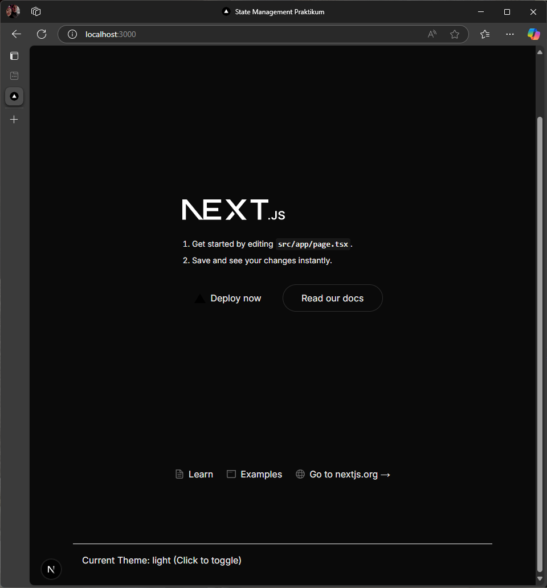
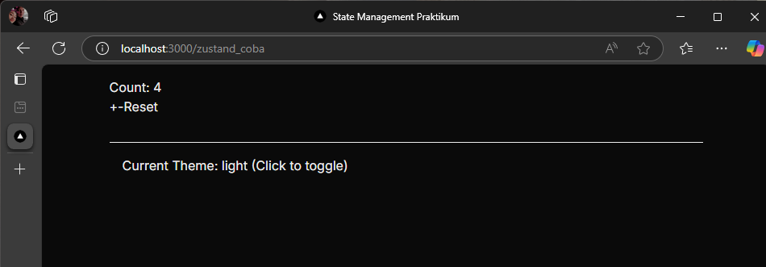
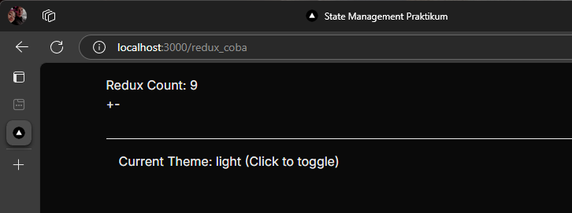
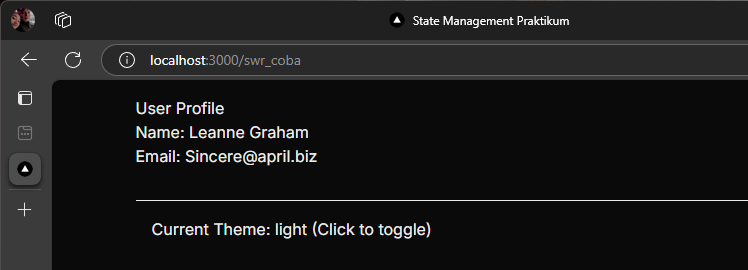
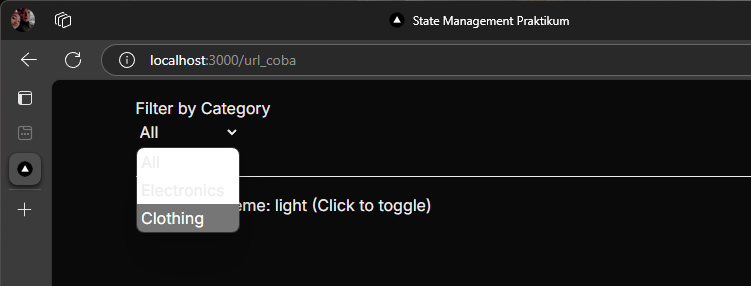

# Practicum
## 1. React Context untuk State Global Sederhana

## 2. Zustand untuk State Management Kompleks

## 3. Redux Toolkit dengan SSR Support

## 4. Data Fetching dengan SWR

## 5. URL State Management

# Tugas
## 1. Bandingkan performa antara Context API, Zustand, dan Redux
- Context API merupakan fitur bawaan React yang cocok digunakan untuk pengelolaan state global yang sederhana, seperti tema atau autentikasi. Namun, performanya kurang efisien jika digunakan untuk state yang sering berubah atau digunakan oleh banyak komponen, karena dapat menyebabkan re-render berantai yang tidak perlu. 
- Zustand adalah library manajemen state yang ringan dan efisien, karena menyimpan state di luar React tree dan hanya memicu re-render pada komponen yang benar-benar membutuhkannya. Zustand sangat cocok untuk aplikasi menengah hingga besar yang membutuhkan performa tinggi dan fleksibilitas, tanpa harus menulis banyak kode boilerplate seperti Redux. 
- Redux Toolkit menawarkan struktur yang kuat dan ideal untuk aplikasi skala besar. Redux mendukung DevTools, middleware, dan testing dengan baik, namun memiliki setup awal yang lebih kompleks dan bisa terasa berlebihan jika digunakan pada proyek kecil dengan kebutuhan state yang tidak terlalu rumit.

## 2. Diskusikan kapan sebaiknya menggunakan masing-masing solusi
### Context API cocok digunakan ketika:
- Aplikasi kecil atau menengah
- State yang ingin disimpan bersifat global tapi jarang berubah, seperti: tema aplikasi (light/dark), bahasa (en/id), atau user login
- Tidak butuh fitur debugging atau struktur kompleks
#### Contoh: pengaturan dark mode atau menyimpan data user login
### Zustand cocok digunakan ketika:
- Ingin manajemen state yang lebih efisien dan fleksibel
- Aplikasi menengah ke besar, tapi tidak ingin ribet seperti Redux
- State sering berubah dan digunakan oleh banyak komponen
- Ingin menghindari banyak boilerplate
#### Contoh: e-commerce app dengan banyak state seperti filter, keranjang, notifikasi, dsb.
### Redux Toolkit cocok digunakan ketika:
- Aplikasi besar dan kompleks, apalagi jika dikerjakan oleh banyak developer
- Kamu perlu fitur seperti middleware, time-travel debugging, atau pengelolaan async logic yang kuat
- Kamu ingin semua state tersentralisasi dan mudah diuji
- Perlu pola kerja dan arsitektur yang jelas
#### Contoh: dashboard admin besar, aplikasi enterprise, aplikasi dengan REST API yang kompleks

